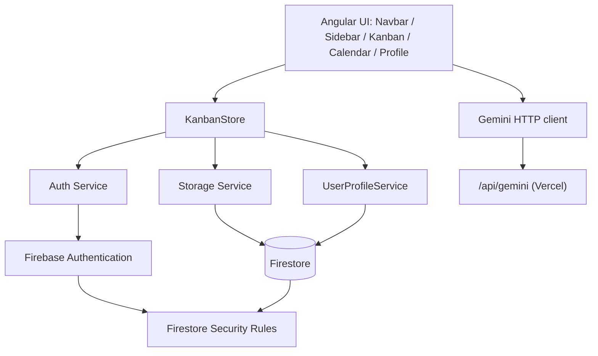

# Omni Sync

Omni Sync is an Angular productivity app that combines Kanban boards and a calendar view, with Firebase Authentication, Firestore persistence, optional collaborative boards, and Gemini-assisted task metadata.

## Features

- **Kanban** — Columns, tasks, drag-and-drop, board lifecycle, **shared boards** (invite by username), workspace sync
- **Calendar** — FullCalendar view backed by the same task data
- **Profiles** — Username, first and last name stored in Firestore; signed-in users must complete profile before using boards/calendar (route guards + redirect from home after sign-in)
- **Authentication**
  - Google sign-in
  - Email/password sign-up and sign-in (verification where configured)
  - Password reset
  - Email link (passwordless) sign-in
- **AI (Gemini)** — Server-side `/api/gemini` route suggests task fields from the add-task flow (API key never shipped to the browser)
- **Data**
  - Signed-in users: Firestore (`kanban/{uid}`, `users/{uid}`, `usernames/{handle}`, `boardWorkspaces/{boardId}`, …) plus local cache where implemented
  - Guests: localStorage

## Architecture Overview



## Tech Stack

- Angular 21
- Angular CDK
- AngularFire (Auth, Firestore, Analytics)
- FullCalendar
- Tailwind CSS
- Vercel serverless API route for Gemini (`api/gemini.ts`)

## Getting Started

### 1) Install dependencies

```bash
npm install
```

### 2) Environment files

- **Firebase** — Use `src/environments/environment.development.ts` locally (see `src/environments/environment.example.ts`). Production/CI builds can generate `environment.ts` via `set-env.js` when `FIREBASE_*` variables are set.
- **Gemini (local / Vercel)** — Copy `.env.example` to `.env` in the project root and set `GEMINI_API_KEY`. Do not commit `.env` (it is gitignored).

### 3) Run locally

**Angular only** (UI + Firebase; Gemini HTTP route is not served):

```bash
npm start
```

App: `http://localhost:4200`.

**Full stack** (Angular + Vercel API routes including `/api/gemini`, loads `.env`):

```bash
npm run dev:vercel
```

Use `npm run dev` only if you intend the same as `npm start` (both run `ng serve`).

## Scripts

| Script              | Description                                                |
| ------------------- | ---------------------------------------------------------- |
| `npm start`         | Dev server (`ng serve`)                                    |
| `npm run dev`       | Same as `npm start`                                        |
| `npm run dev:vercel`| Local Vercel dev (app + `/api/*`)                           |
| `npm run build`     | `set-env.js` then production Angular build                 |
| `npm run watch`     | Build watch (development configuration)                    |
| `npm run test`      | Unit tests                                                 |
| `npm run lint`      | ESLint                                                     |
| `npm run format`    | Prettier                                                   |
| `npm run check-all` | Format + lint                                              |

## Environment Variables

### Firebase (CI / Vercel / `set-env.js`)

When all are present, `set-env.js` writes `src/environments/environment.ts` at build time:

- `FIREBASE_API_KEY`
- `FIREBASE_AUTH_DOMAIN`
- `FIREBASE_PROJECT_ID`
- `FIREBASE_STORAGE_BUCKET`
- `FIREBASE_MESSAGING_SENDER_ID`
- `FIREBASE_APP_ID`
- `FIREBASE_MEASUREMENT_ID`

If any are missing, generation falls back to existing/example files.

### Gemini

- **Local:** `.env` with `GEMINI_API_KEY` (used by `api/gemini.ts` via `dotenv` and by `vercel dev`).
- **Vercel:** Set `GEMINI_API_KEY` in the project’s Environment Variables.

## Firestore Security Rules

Authoritative example for this app’s collections (`users`, `usernames`, `kanban`, `boardWorkspaces`) lives in **`firestore.rules`** at the repo root. Deploy or paste those rules into the Firebase Console.

## Firebase Auth Setup Checklist

In Firebase Console → Authentication → Sign-in method, enable what you use (e.g. Google, Email/Password, Email link).

Also ensure:

- Authorized domains include `localhost` and your production domain
- Email templates are configured for verification/reset if required

## Deploying to Vercel

1. Import the repository into Vercel.
2. Configure **Firebase** env vars (see above) for production builds.
3. Add **`GEMINI_API_KEY`** if you use AI features.
4. Deploy; build command: `npm run build`.

## Troubleshooting

- **`Could not resolve ../environments/environment`**  
  Ensure `src/environments/environment.ts` exists or your CI runs `set-env.js` with full `FIREBASE_*` vars before `ng build`.

- **`GEMINI_API_KEY` / Gemini errors locally**  
  Use `npm run dev:vercel` so `/api/gemini` runs, or deploy to Vercel; plain `ng serve` does not host serverless routes.

- **`auth/popup-blocked`**  
  Allow popups or retry; check Firebase authorized domains.

- **Firestore `permission-denied`**  
  Deploy rules from `firestore.rules` and confirm the user is signed in with the expected `uid`.

## Notes on Security

Firebase web config (`apiKey`, `authDomain`, …) is not a secret; protection comes from **Firestore rules**, **Auth**, and optional **App Check**. Never commit **service account keys**, admin SDK secrets, or **`.env`** with production API keys.
